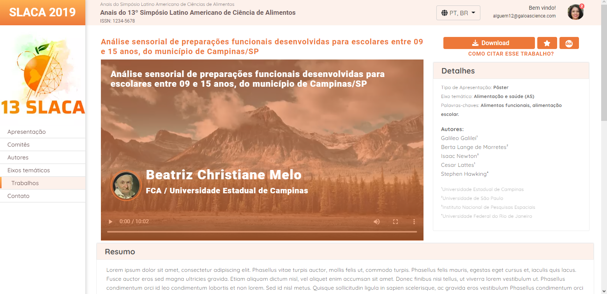

# Slaca2019 Front-end Chuvainc

<h4 align="center"><a href="https://gabriellimmaa.github.io/slaca2019-chuvainc-frontend/">Clique para visitar o site</a></h4>
<h4 align="center"><a href="https://www.figma.com/file/0D27YdXU8ibf0AhsBC2OEm/Chuva---Exerc%C3%ADcio-Frontend">Clique para visitar o figma</a></h4>

---
## 📚 Seções
O site é composto por cinco seções:
- **Tela de base:** Tela base do site;
- **Criando novo tópico:** Tela ao clicar para criar novo tópico;
- **Tópico enviado:** Tela de tópico enviado;
- **Resumo expandido:** Resumo principal expandido;
- **Card tópico expandido:** Resumo do card expandido;
---
## 🛠️ Construído com
Para o desenvolvimento deste site utilizei as seguintes tecnologias:
- HTML;
- CSS;
- JavaScript;
- Bootstrap;
---
## ✒️ Autor

<table>
  <tr>
    <td align="center">
      <a href="https://github.com/Gabriellimmaa">
         
        
          <b>Gabriel Lima</b>
        
      </a>
    </td>
  </tr>
</table>

---

Obrigado por me ceder seu tempo lendo sobre o meu trabalho.

Qualquer dúvida, crítica ou sugestão entre em <a href="mailto:gabriellimamoraes@gmail.com/">contato</a> pelo meu e-mail

